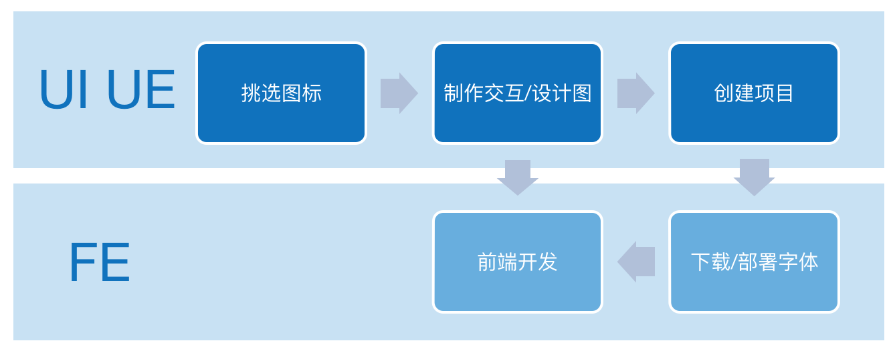

# YIcon 平台简介

## 目标

YIcon 是一个图标字体生成平台，不同的部门可以申请在平台上创建大库，业务线可以选择需要的图标添加到购物车，保存成项目之后进行维护。它可以方便的将 SVG 图标转换为字体图标，提供给 UI/UE 和前端开发使用。

## 优势

与传统制作图标的方式相比，它拥有如下优势：

1. **严格的审核流程** 图标上传后用户会进行一次编辑，之后会提交到审核，被大库的管理员审核通过后方能入库；
2. **可控的项目版本** 我们的项目每次变动之后再下载，就会生成新的版本，因此在项目中产生的所有版本都可以追溯查看；
3. **完善的权限管理** 我们拥有超管后台，可以自由的控制大库、项目管理员的权限。

如果你是去哪儿网内网用户，请[直接访问该站点](http://iconfont.corp.qunar.com)。